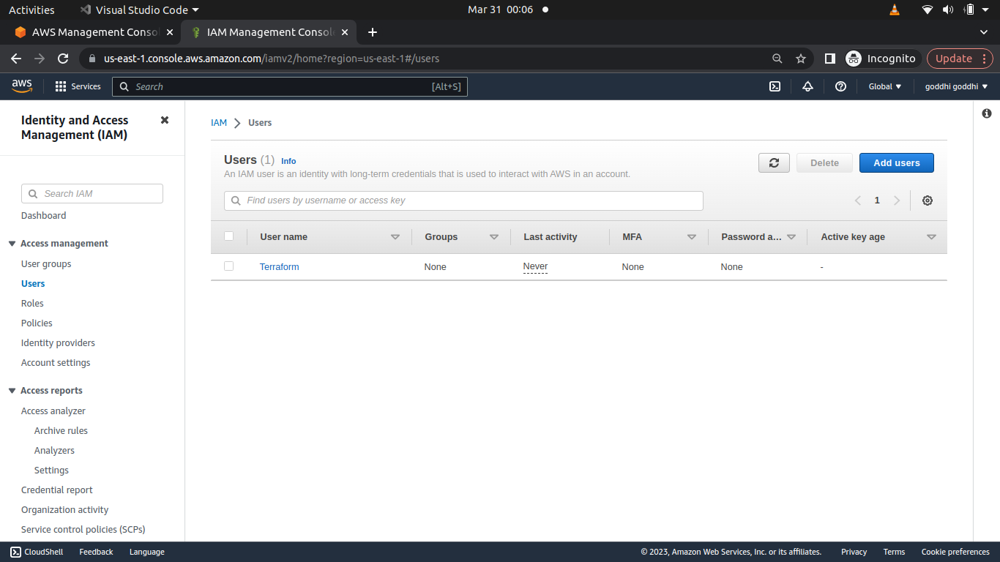
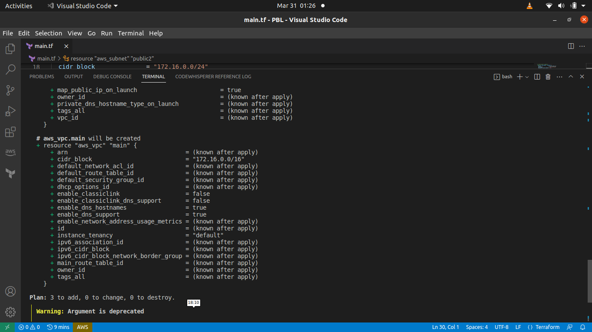
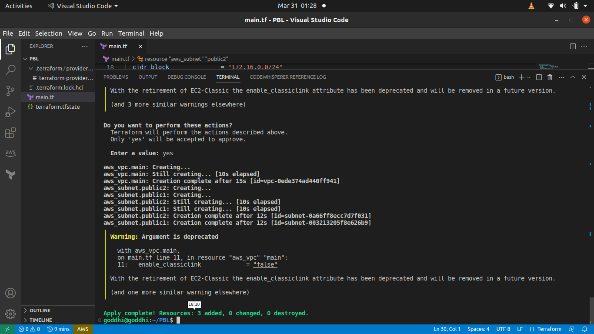

### AUTOMATE INFRASTRUCTURE WITH IAC USING TERRAFORM PART 1

## Table of Contents
- [Introduction](https://github.com/Goddhi/Terraform-part1#introduction)
- [prerequisites](https://github.com/Goddhi/Terraform-part1#prerequisites)
- [Create an S3 bucket](https://github.com/Goddhi/Terraform-part1#create-an-s3-bucket)
- [Creating our Terraform project](https://github.com/Goddhi/Terraform-part1#creating-our-terraform-project)
- [Setup Terraform CLI](https://github.com/Goddhi/Terraform-part1#setup-terraform-cli)
- [Provider and VPC resource section](https://github.com/Goddhi/Terraform-part1#provider-and-vpc-resource-section)
- [Subnets resource section](https://github.com/Goddhi/Terraform-part1#subnets-resource-section)
- [Observations](https://github.com/Goddhi/Terraform-part1#observations)
- [Fixing The Problems By Code Refactoring](https://github.com/Goddhi/Terraform-part1#fixing-the-problems-by-code-refactoring)
- [Fixing Hard Coded Values](https://github.com/Goddhi/Terraform-part1#fixing-hard-coded-values)
- [Fixing Multiple Resource Blocks](https://github.com/Goddhi/Terraform-part1#fixing-multiple-resource-blocks)
- [Making the cidr_block dynamic](https://github.com/Goddhi/Terraform-part1#making-the-cidr_block-dynamic)
- [Removing the hard code count value](https://github.com/Goddhi/Terraform-part1#removing-the-hard-code-count-value)
- [Introducing variables.tf & terraform.tfvars](https://github.com/Goddhi/Terraform-part1#introducing-variablestf--terraformtfvars)
- [variables.tf](https://github.com/Goddhi/Terraform-part1#variablestf)
- [terraform.tfvars](https://github.com/Goddhi/Terraform-part1#terraformtfvars)
- [Conclusion](https://github.com/Goddhi/Terraform-part1#conclusion)


### Introduction

In the previous project [Link to the project here](https://github.com/Goddhi/MANUALLY-IMPLEMENTING-AWS-CLOUD-SOLUTION-FOR-2-COMPANY-WEBSITES-USING-A-REVERSE-PROXY-TECHNOLOGY), we manually implemented an AWS Infrastructure as Code. This project is the first part of a four-part series. Here we will automate the infrastructure using Terraform. Terraform is an open-source infrastructure as code (IaC) tool created by HashiCorp. Users define and provide data center infrastructure using a declarative configuration language known as HashiCorp Configuration Language, or optionaslly JSON. Terraform generates an execution plan describing what it will do to reach the desired state and then executes it to build the described infrastructure. As the configuration changes, Terraform can determine what changed and create incremental execution plans which can be applied.


### Prerequisites

- AWS Account
- AWS CLI installed and configured
- Create an IAM user and name it terraform and ensure you grant it - - AdministratorAccess permissions also grant it programmatic access.
- Configure programmatic access from your local machine to connect to AWS using the access keys generated for the user and a python sdk called boto3.

[Guide on hoe to create IAM user and grant it programmatical access](https://docs.aws.amazon.com/IAM/latest/UserGuide/id_users_create.html)

[Guide to configure AWS on your local machine using boto3](https://boto3.amazonaws.com/v1/documentation/api/latest/guide/quickstart.html)


output: 


### Create an S3 bucket

- Create an s3 bucket to store our Terraform state file.
- You can name it something like '-dev-terraform-bucket' Note: Names - must be unique within a region partition.
- Navigate to the S3 service and create a bucket.
- Select the region you want to use.
- Specify your bucket name according to the naming convention specified earlier.
- Ensure you leave block all public access to the bucket checked.
- Enable bucket versioning.
- Specify the tag: which can be the name of the bucket.
- Click on create bucket.

- To check if our aws cli is configured correctly, run the following command:

```
aws s3 ls
```
expect to see the name of your s3 bucket

### Creating our Terraform project
- We would be creating a directory structure for our project.

- Create a folder called PBL
```
mkdir PBL
```

- Create a file in the folder and name it main.tf

```
cd PBL
touch main.tf
```
### Setup Terraform CLI
Set up Terraform CLI on your local machine. [Here is a guide on how to do that](https://learn.hashicorp.com/tutorials/terraform/install-cli)

### Provider and VPC resource section
- Add AWS as a provider, and a resource to create a VPC in the main.tf file.

- Provider block informs Terraform that we intend to build infrastructure within AWS.

- Resource block will create a VPC.

```provider "aws" {
    region = "us-east-1"
}

# create a VPC
resource "aws_vpc" "main" {
    cidr_block = "172.16.0.0/16"
    enable_dns_support = "true"
    enable_dns_hostnames = "true"
    enable_classiclink = "false"
    enable_classiclink_dns_support = "false"
}
```
- Initialize Terraform to download the AWS provider plugin.

```
terraform init
```
- Moving on, let us create the only resource we just defined. aws_vpc. But before we do that, we should check to see what terraform intends to create before we tell it to go ahead and create it.

```
terraform plan
```


- Then, if you are happy with changes planned, execute 'terraform apply' to create the resource.

```
terraform apply --auto-approve
```


### Subnets resource section
- According to our architectural design, we require 6 subnets:

- 2 public subnets

- 2 private subnets for webservers

- 2 private subnets for data layer

- Let's create the 2 public subnets. Add the following configuration to the main.tf file.

```
# Create public subnets1
resource "aws_subnet" "public1" {
    vpc_id                  = aws_vpc.main.id
    cidr_block              = "172.16.0.0/24"
    map_public_ip_on_launch = true
    availability_zone       = "us-east-1a"
}

# Create public subnets2
resource "aws_subnet" "public2" {
    vpc_id                  = aws_vpc.main.id
    cidr_block              = "172.16.1.0/24"
    map_public_ip_on_launch = true
    availability_zone       = "us-east-1b"
}
```
Note: We are creating 2 subnets, which involves declaring 2 resource blocks, one for each of the subnets. We are also using the vpc_id argument to specify the VPC we created earlier. We are also specifying the cidr_block, map_public_ip_on_launch and availability_zone arguments.

- Then run terraform plan to see what terraform intends to create.

```
terraform plan
```

Run terraform apply to create the resources.

```
terraform apply --auto-approve
```

### Observations

- If we look through our current terraform setup, we would notice the following


    - We have hard-coded most of the values in our configuration.
    - We have declared multiple resource blocks for each subnet in the code which is not DRY(Do-Not-Repeat-Yourself).

- We would have to work on refactoring our code to make it more dynamic and reusable.

- Let's destroy our current setup before we refactor. Note: do not destroy an infrastructure you are using in production.

```
terraform destroy --auto-approve
```
### Fixing The Problems By Code Refactoring

Like we mentioned earlier, we would have to refactor our code to make it more dynamic and reusable.

#### Fixing Hard Coded Values

We will introduce variables, and remove hard coding.

    - Let's begin with the provider block, declare a variable named region and sssign it a default value of us-west-2.

```variable "region" {
    default = "us-west-2"
}

```

Let's do the same to the 'cidr' value in the 'vpc' block and all the other arguments..

```

variable "region" {
    default = "us-east-1"
}

variable "vpc_cidr" {
    default = "172.16.0.0/16"
}

variable "enable_dns_support" {
    default = "true"
}

variable "enable_dns_hostnames" {
    default ="true" 
}

variable "enable_classiclink" {
    default = "false"
}

variable "enable_classiclink_dns_support" {
    default = "false"
}

provider "aws" {
region = var.region
}

# Create VPC
resource "aws_vpc" "main" {
cidr_block                     = var.vpc_cidr
enable_dns_support             = var.enable_dns_support 
enable_dns_hostnames           = var.enable_dns_support
enable_classiclink             = var.enable_classiclink
enable_classiclink_dns_support = var.enable_classiclink

}
```
### Fixing Multiple Resource Blocks

This is where things become a little tricky. It’s not complex, we are just going to introduce some interesting concepts. Loops & Data sources. Terraform has a functionality that allows us to pull data that exposes information to us. For example, every region has Availability Zones (AZ). Different regions have from 2 to 4 Availability Zones. With over 20 geographic regions and over 70 AZs served by AWS, it is impossible to keep up with the latest information by hard coding the names of AZs. Hence, we will explore the use of Terraform’s Data Sources to fetch information outside of Terraform. In this case, AWS.

    - Let's begin by fetching the list of AZs from AWS and replace the hard-coded value in the subnet's availability_zone argument.

```
data "aws_availability_zones" "available" {
state = "available"
}
```
- To make use of this new 'data' resource, we would need to introduce a 'count' argument in the subnet block

```
# Create public subnet1
resource "aws_subnet" "public" { 
    count                   = 2
    vpc_id                  = aws_vpc.main.id
    cidr_block              = "172.16.1.0/24"
    map_public_ip_on_launch = true
    availability_zone       = data.aws_availability_zones.available.names[count.index]

}
```
Note: The count tells us that we need 2 subnets. Therefore, terraform would invoke a loop to create 2 subnets. The 'count.index' argument is used to get the index of the current iteration of the loop. The data.aws_availability_zones.available.names argument is used to get the list of AZs from the data resource we created earlier.

Each of them is an index, the first one is index 0, while the other is index 1. If the data returned had more than 2 records, then the index numbers would continue to increment. Therefore, each time Terraform goes into a loop to create a subnet, it must be created in the retrieved AZ from the list. Each loop will need the index number to determine what AZ the subnet will be created. That is why we have 'data.aws_availability_zones.available.names[count.index]' as the value for availability_zone. When the first loop runs, the first index will be 0, therefore the AZ will be us-east-1a. The pattern will repeat for the second loop.

#### Making the cidr_block dynamic

We still have a problem. If we run Terraform with this configuration, it may succeed for the first time, but by the time it goes into the second loop, it will fail because we still have cidr_block hard coded. The same cidr_block cannot be created twice within the same VPC. So, we have a little more work to do.

- To fix this, let's introduce a function 'cidrsubnet()' to make this happen. It would accept 3 parameters, the first parameter is the cidr_block, the second parameter is the number of bits to allocate to the new subnet, and the third parameter is the index number of the subnet. The index number is the same index number we used in the count.index argument. The function will return a new subnet cidr_block.

```
# Create public subnet1
resource "aws_subnet" "public" { 
    count                   = 2
    vpc_id                  = aws_vpc.main.id
    cidr_block              = cidrsubnet(var.vpc_cidr, 4, count.index)
    map_public_ip_on_launch = true
    availability_zone       = data.aws_availability_zones.available.names[count.index]

}
```
Note: The 'cidrsubnet' function works like an algorithm to dynamically create a subnet CIDR per AZ. Regardless of the number of AZs in a region, the function will always create a subnet CIDR for each AZ. It's parameters are as follows:

```
cidrsubnet(prefix, newbits, netnum)
```
- The prefix parameter must be given in CIDR notation, same as for VPC.
- The newbits parameter is the number of additional bits with which to extend the prefix. For example, if given a prefix ending with /16 and a newbits value of 4, the resulting subnet address will have length /20
- The netnum parameter is a whole number that can be represented as a binary integer with no more than newbits binary digits, which will be used to populate the additional bits added to the prefix

#### Removing the hard code count value

We still have a problem. We have a hard coded value of 2 in the count argument. This is not ideal. We want to make this dynamic. We want to make the number of subnets created dynamic. We want to make the number of subnets created equal to the number of AZs in the region. We can do this by using the length() function. The length() function returns the number of elements in a list. We can use this function to get the number of AZs in the region and use it as the count value.

    - We can experiment with the length function in our terraform console

```
    terraform apply --auto-approve
terraform console
length(data.aws_availability_zones.available.names)
```
- Now we can simply update the public subnet block like this:

- If you notice from the terraform console we ran earlier, the length of the list of AZs is 6, but what we need is 2. To fix this:

    - Declare a variable to store the desired number of public subnets and set the default value to 2

```
variable "preferred_number_of_public_subnets" {
    default = 2
}
```
    - Update the count argument with a condition. As we need to tell terraform to check if there is a desired number of subnets, if not, then use the length of the list of AZs. The condition would look like this:

```
count  = var.preferred_number_of_public_subnets == null ? length(data.aws_availability_zones.available.names) : var.preferred_number_of_public_subnets 
```
Note: The condition is a ternary operator. It is a shorthand way of writing an if statement. It has 3 parts:

    - The first part 'var.preferred_number_of_public_subnets == null' is the condition. It checks if the value of the variable 'preferred_number_of_public_subnets' is null. If it is null, then it will return true, otherwise, it will return false.

    - The second part '?' and 'length(data.aws_availability_zones.available.names)' means, if the first part is true, then use this. In other words, if the preferred number of public subnets is null (Or not known) then set the value to the data returned by the length function.

    - The third part ':' and 'var.preferred_number_of_public_subnets' means, if the first condition is false, i.e preferred number of public subnets is not null then set the value to whatever is defined in 'var.preferred_number_of_public_subnets'

### Introducing variables.tf & terraform.tfvars

Instead of having a long list of variables in 'main.tf' file, we can make our code a lot more readable and better structured by moving out some parts of the configuration content to other files.

We will put all variable declarations in a separate file. And provide non-default values to each of them

#### variables.tf
    - Create a new file called 'variables.tf' and move all variable declarations to this file. The file should look like this:

```
variable "region" {
default = "us-east-1"
}

variable "vpc_cidr" {
default = "172.16.0.0/16"
}

variable "enable_dns_support" {
default = "true"
}

variable "enable_dns_hostnames" {
default = "true"
}

variable "enable_classiclink" {
default = "false"
}

variable "enable_classiclink_dns_support" {
default = "false"
}

variable "preferred_number_of_public_subnets" {
default = 2
}
```
#### terraform.tfvars
    - Create another file called 'terraform.tfvars' and provide non-default values to each of the variables. The file should look like this:

```
region = "us-east-1"

vpc_cidr = "172.16.0.0/16" 

enable_dns_support = "true" 

enable_dns_hostnames = "true"  

enable_classiclink = "false" 

enable_classiclink_dns_support = "false" 

preferred_number_of_public_subnets = 2
```

- You can now run terraform plan to ensure that everything works well.

```
terraform plan
```
### Conclusion
We have learned how to create and delete AWS network infrastructure programmatically with Terraform. We have also learned how to use variables, data sources, and functions to make our code more dynamic and reusable. We have also learned how to use the terraform console to experiment with the code and how to use the terraform plan command to check for errors before applying the changes.
